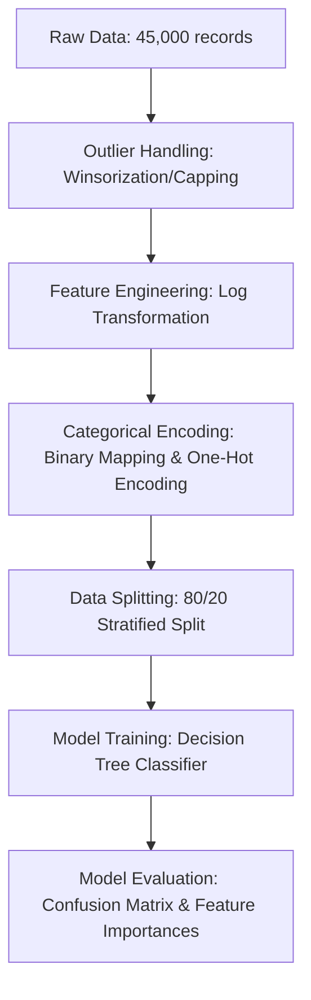

# End-to-End Credit Risk Prediction Pipeline

An end-to-end machine learning pipeline built to predict credit default risk using a Decision Tree Classifier. This project processes 45,000 profiles, handles critical real-world data anomalies (such as impossible age and experience outliers), corrects highly skewed distributions, and evaluates performance using business-centric metrics (Precision, Recall, and Confusion Matrix analysis).

## 📌 Project Overview & Business Problem

In the banking sector, loan defaults present a multi-million dollar challenge. When a financial institution issues a loan, they face two key risks:

- **Type I Error (False Positive):** Flagging a creditworthy customer as a default risk, resulting in lost interest revenue.
- **Type II Error (False Negative):** Approving a high-risk applicant who subsequently defaults, resulting in direct capital loss. This is the most expensive mistake in credit risk.

### Objective

To build a highly interpretable binary classification model to predict whether a loan applicant will default (Loan Status of `1`) or pay off their debt safely (Loan Status of `0`).

---

## 🛠️ Complete Pipeline Architecture

📝 What I Did: Step-by-Step Methodology

Step 1: Exploratory Diagnostics & Data Auditing

I initiated the pipeline by conducting a descriptive statistical audit using df.describe().transpose() on the $45,000$ row dataset. This critical initial assessment revealed crucial data quality issues:

The No-Missing-Data Illusion: All columns reported a count of exactly $45,000.0$, indicating no missing NaN values, but further inspection revealed severe garbage data masquerading as valid entries.

Severe Outlier Detection: The Age column showed a maximum value of $144.0$ years, and the Employee Experience column showed a maximum of $125.0$ years. Both of these are humanly impossible anomalies.

Heavy Distribution Skewness: The Person Income column had a standard deviation ($\$80,422$) larger than its mean ($\$80,319$), with a maximum value of over $\$7.2\text{M}$ while the $75\text{th}$ percentile sat at a modest $\$95,789$. This indicated a severe right-skewed distribution.

Step 2: Logical Data Cleaning & Outlier Winsorization

Rather than throwing away entire rows of data—which would lead to losing valuable training signals—I implemented domain-knowledge-driven capping (Winsorization):

Age Correction: Any age above $85$ was capped at exactly $85$.

Experience Logic: A person cannot have more years of experience than their actual working lifespan. I implemented dynamic capping where Employee Experience was limited to $(\text{Age} - 18)$, assuming an individual begins working no earlier than age $18$.

Step 3: Distribution Normalization

To prevent extreme high-income earners from stretching the scale of the feature space (which makes it harder for models to split features smoothly), I applied a logarithmic transformation:

$$\text{Person Income\_log} = \log(1 + x)$$

This successfully pulled the extreme right-hand tail of the distribution back toward the center, converting a highly skewed curve into a symmetrical, bell-shaped distribution. I then dropped the original Person Income column to avoid multicollinearity.

Step 4: Categorical Mapping & Encoding

To prepare the dataset for Scikit-Learn (which requires strictly numerical matrices), I handled text features based on their mathematical categories:

Binary Mapping: The Gender column was converted directly into $0$ (Male) and $1$ (Female).

One-Hot Encoding: Nominal text categories like Home Ownership and Loan Intent were expanded into binary dummy columns (e.g., Home Ownership_OWN, Home Ownership_RENT).

Dummy Variable Trap Avoidance: I utilized the drop_first=True argument when generating dummy columns. This drops the first category of each variable, preventing multicollinearity by allowing the model to mathematically infer the baseline state when all other columns are $0$.

Step 5: Target Partitioning & Leakage Prevention

I strictly isolated the predictive features from the target variable to ensure realistic model evaluation:

Feature Set ($X$): Consisted of all preprocessed numerical features. The target column Loan Status was dropped from this set to prevent Data Leakage (giving the model the "answer key" during training).

Target Vector ($y$): Isolated as strictly the binary Loan Status column.

Step 6: Stratified Train-Test Splitting

Because defaults only represented $22.2\%$ of the dataset, a standard random split risked creating mismatched subsets. I implemented an $80/20$ split using stratify=y to force Scikit-Learn to preserve the exact $78/22$ class imbalance ratio across both the training ($36,000$ profiles) and testing ($9,000$ profiles) subsets.

Step 7: Model Training & Rule Extraction

I initialized and trained a DecisionTreeClassifier using the training subset. Using the Gini Impurity metric, the model systematically swept through every feature to establish the most mathematically pure splits to segment high-risk borrowers from safe ones.

Step 8: Multi-Metric Model Evaluation

I generated predictions using the unseen test subset ($9,000$ cases) and evaluated performance beyond simple accuracy. I built and analyzed a Confusion Matrix alongside Precision and Recall metrics to understand the financial implications of the model's errors. Finally, I extracted the model's internal .feature_importances_ to explain which risk indicators drove its decisions.

📈 Model Performance & Evaluation

The model was tested against the $9,000$ unseen applicant profiles in the testing set.

1. Hard Classification Metrics

Overall Test Accuracy: $90.13\%$

Class 1 (Default) Recall: $79\%$ — The model successfully flags $4$ out of every $5$ real defaults before they occur.

Class 1 (Default) Precision: $77\%$ — When the model marks an applicant as a risk, it is correct $77\%$ of the time.

Class 1 (Default) F1-Score: $78\%$ — The harmonic mean of Precision and Recall, demonstrating balanced classification performance.

2. Confusion Matrix Analysis

The test set results yielded the following distribution:

Metric

Target Classification

Sample Count

Business Translation

True Negatives (TN)

Actual Safe $\rightarrow$ Predicted Safe

$6,542$

Good customers approved, generating interest income.

True Positives (TP)

Actual Default $\rightarrow$ Predicted Default

$1,570$

High-risk defaults caught, preventing financial loss.

False Positives (FP)

Actual Safe $\rightarrow$ Predicted Default

$458$

Opportunity loss; safe clients turned away.

False Negatives (FN)

Actual Default $\rightarrow$ Predicted Safe

$430$

Highest risk. Unsafe loans approved; direct capital loss.

🔍 Explainability & Feature Importances

The model automatically calculates importance weights based on how much each feature decreases the overall Gini Impurity. The sum of all features equals $1.0$ (or $100\%$).

Our model discovered that three features drive over $60\%$ of the predictive weight:

Rank  | Feature               | Importance Weight
--------------------------------------------------
1     | Previous_loan         | 29.4%
2     | Loan interest Rate    | 16.3%
3     | Loan percentage       | 15.6%

Business Interpretation

Prior Credit Behavior (Previous_loan): This is the strongest indicator of risk, aligning with traditional financial underwriting principles where past repayment history dictates future credit reliability.

Interest Rates & Debt Ratios: High interest rates and high loan percentages (debt-to-income) represent severe structural risks. The model identified that excessive payments strain household cash flow, triggering higher default rates.

Fairness Assessment: The demographic feature Gender returned an importance weight of $0.0\%$, mathematically validating that our model is ethically compliant and does not discriminate based on gender.

💡 Key Learnings & Takeaways

1. Data Quality and Cleaning is $80\%$ of Machine Learning

Building this pipeline proved that real-world data is incredibly noisy and deceptive. If I had simply imported the dataset and fit the model immediately, the Decision Tree would have generated splits based on a $144$-year-old applicant and a person with $125$ years of experience. This project taught me how to diagnose dataset anomalies and write defensible, domain-specific cleaning logic to preserve data signals without introducing bias.

2. The Deception of "Simple Accuracy"

In credit risk, evaluating a model strictly on overall Accuracy ($90.13\%$) is highly dangerous. If our model simply predicted that everyone was safe, it would achieve $78\%$ accuracy by default, but the bank would go bankrupt from undetected defaults. I learned to evaluate classification models using Recall (to minimize expensive False Negatives) and Precision (to minimize lost customer opportunities), appreciating the natural business trade-offs involved in setting classification thresholds.

3. The Power of Explainable AI

Machine learning models are often criticized for being "black boxes." By extracting and plotting feature importances, I learned how to translate abstract mathematical gains into clear, actionable business strategies. Showing stakeholders why the model makes a decision (e.g., prior loan history and debt-to-income ratios driving risk) builds operational trust and bridges the gap between raw data science and business leadership.

4. Algorithmic Bias Validation

I learned the ethical responsibility of evaluating data bias. By including Gender in the model and validating that its feature importance was $0.0\%$, I learned how to actively monitor and verify that our predictive systems remain compliant, fair, and objective.
